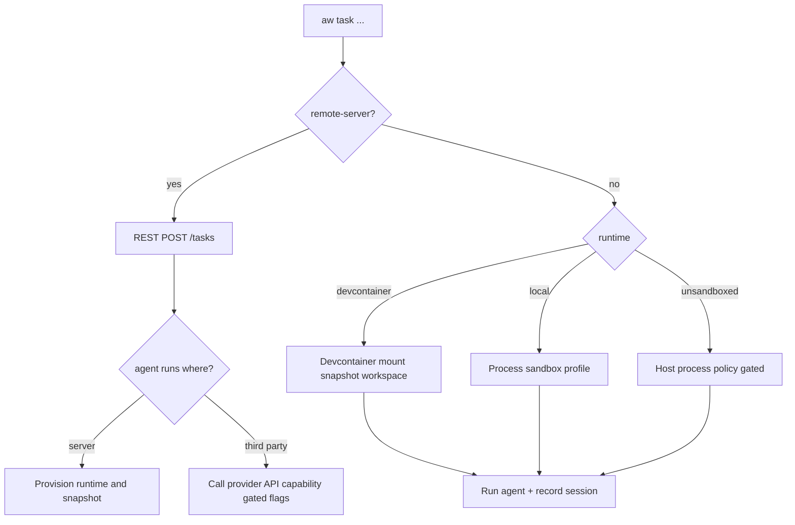

## AW CLI — Command-Line and TUI Specification

### Overview

The AW CLI (`aw`) unifies local and remote workflows for launching and managing agent coding sessions. Running `aw` with no subcommands starts the TUI dashboard. Subcommands provide scriptable operations for task/session lifecycle, configuration, repository management, and developer ergonomics.

The CLI honors the layered configuration model in [Configuration](Configuration.md) (system, user, project, project-user, env, CLI flags). Flags map from config keys using the `--a-b-c` convention and env var prefix `AGENTS_WORKFLOW_`.

### Primary Goals

- One tool for both the TUI dashboard and automation-ready commands
- First-class support for:
  - Local state mode (SQLite only)
  - Remote REST service mode (on-prem/private cloud), aligned with `docs/rest-service.md`
  - Terminal multiplexers: tmux, zellij, screen
  - Devcontainers and local runtimes (including unsandboxed, policy-gated)
  - IDE integrations (VS Code, Cursor, Windsurf) and terminal-based agents

### Modes of Operation

- **Local vs Remote:** Local mode manages state with a local SQLite DB and runs tasks on the current machine; see [Local Mode](Local%20Mode.md). Remote mode targets an Agents‑Workflow REST service; the CLI becomes a thin client while execution/state live on the server; see [Remote Mode](Remote%20Mode.md).
- **TUI vs WebUI:** `aw` can start either a terminal dashboard (TUI) or open the WebUI. The UIs present the same concepts (tasks, sessions, logs, time‑travel) with different affordances. See [TUI PRD](TUI%20PRD.md) and [WebUI PRD](WebUI%20PRD.md).
- **Orthogonal choices:** UI (TUI/WebUI) and execution location (local/remote) are orthogonal. Any combination is possible; e.g., run the TUI against a remote REST service or use the WebUI locally.
- **Fleets combine local and remote:** [Multi-OS testing fleets](Multi-OS%20Testing.md) can mix local and remote agents. For example, a local Linux container leader may have remote followers (e.g., a Windows VM on a server). The `aw` client and server may need to orchestrate together the connectivity between all the machines in the fleet.
- **Sandbox profiles (orthogonal):** When launching locally, sandbox profiles define the isolation level (container, VM, bwrap/firejail, or unsandboxed per policy). See [Sandbox Profiles](Sandbox%20Profiles.md) and configuration mapping below.

### Global Behavior and Flags
Naming consistency: the config key controlling UI selection is `ui`, not `ui.default`.

- `aw` (no args): Launches the default UI (TUI by default). Config key `ui` controls TUI vs WebUI; built‑in default is `tui`.
- Common global flags (apply to all subcommands unless noted):  
  - `--remote-server <NAME|URL>`: If provided, use the REST API at this server (by name lookup in config or raw URL). Otherwise use local SQLite state.
  - `--repo <PATH|URL>`: Target repository (filesystem path in local runs; git URL may be used by some servers). If omitted, AW auto-detects a VCS root by walking parent directories and checking all supported VCS.
  - `--workspace <NAME>`: Named workspace (only valid on servers that support workspaces). Errors if unsupported by the selected server.
  - `--multiplexer <tmux|zellij|screen>`: Which multiplexer to use for when launching a TUI session
  - `--json`: Emit machine-readable JSON
  - `--quiet`: Reduce output
  - `--log-level <debug|info|warn|error>`
  - `--no-color`

### Subcommands

#### 1) TUI

- `aw` or `aw tui [--multiplexer <tmux|zellij|screen>] [--remote-server <NAME|URL>]` — See [TUI PRD](TUI%20PRD.md) for full UI details and flows.
- With `--remote-server` (or configured `remote-server`), the same dashboard is presented, but panes may attach to remote sessions over SSH. See [Connectivity Layer](Connectivity%20Layer.md) for options (overlay VPN, SSH via HTTP CONNECT proxy, or session relay).

#### 2) Tasks

- `aw task [create] [--prompt <TEXT> | --prompt-file <FILE>] [--repo <PATH|URL>] [--branch <NAME>] [--agent <TYPE>[@VERSION]] [--instances <N>] [--runtime <devcontainer|local|unsandboxed>] [--devcontainer-path <PATH>] [--labels k=v ...] [--delivery <pr|branch|patch>] [--target-branch <NAME>] [--browser-automation <true|false>] [--browser-profile <NAME>] [--chatgpt-username <NAME>] [--codex-workspace <WORKSPACE>] [--workspace <NAME>] [--fleet <NAME>] [--yes]`

Behavior overview:

- Local vs Remote: With a configured/provided `remote-server`, AW calls the server’s REST API to create/manage the task. Otherwise, AW runs locally.
- Third‑party clouds: Some agents can run on external clouds (e.g., Google Jules, OpenAI Cloud Codex). In such cases, flags like `--instances`, `--browser-*`, or `--codex-workspace` apply only when supported by the selected agent/platform. AW surfaces capabilities via discovery and validates flags accordingly.
- Sandbox/runtime: Local runs honor `--runtime`: `devcontainer` (default when available), `local` (process sandbox/profile), or `unsandboxed` (policy‑gated). See [Sandbox Profiles](Sandbox%20Profiles.md) and [FS Snapshots/FS Snapshots Overview](FS%20Snapshots/FS%20Snapshots%20Overview.md).

Flow (high‑level):



Behavior:

- With a configured/provided `remote-server`, calls the server’s REST API to create and manage the task.
- Otherwise, AW chooses the snapshot strategy automatically based on the host that executes the task (repo filesystem/VM image): prefer ZFS → Btrfs → NILFS2 → OverlayFS → copy (`cp --reflink=auto` when supported). In multi‑OS fleets, snapshots are taken on the leader only; followers receive synchronized state. See [Multi-OS Testing](Multi-OS%20Testing.md).
- Persists session/task state in the local SQLite database; see `docs/state-persistence.md`.
- Fleet resolution: when `--fleet` is provided (or a default fleet is defined in config), AW expands the fleet into one or more members. For local members, it applies the referenced sandbox profile; for `remote` members, it targets the specified server URL/name. Implementations may run members sequentially or in parallel depending on runtime limits.
- When `--browser-automation true` (default), launches site-specific browser automation (e.g., Codex) using the selected agent browser profile. When `false`, web automation is skipped.
- Codex integration: if `--browser-profile` is not specified, discovers or creates a ChatGPT profile per `docs/browser-automation/codex.md`, optionally filtered by `--chatgpt-username`. Workspace is taken from `--codex-workspace` or config; branch is taken from `--branch`.
- Branch autocompletion uses standard git protocol:
  - Local mode: `git for-each-ref` on the repo; cached with debounce.
  - REST mode: server uses `git ls-remote`/refs against admin-configured URL to populate its cache; CLI/Web query capability endpoints for suggestions.

Draft flow (TUI/Web parity):

- CLI supports `--draft` to persist an editable draft; `aw task start <draft-id>` to submit.

#### 3) Sessions

- `aw session list [--status <...>] [--workspace <...>] [--repo <...>] [--remote-server <NAME|URL>]`
- `aw session attach <SESSION_ID>`
- `aw session run <SESSION_ID> process [args]`: Launch a process (e.g. VS Code, Debugger, etc) inside the session namespace, so you can inspect the state of the filesystem, the running processes, etc).
- `aw session logs <SESSION_ID> [-f] [--tail <N>]`
- `aw session events <SESSION_ID> [-f]`
- `aw session stop <SESSION_ID>`
- `aw session pause <SESSION_ID>`
- `aw session resume <SESSION_ID>`
- `aw session cancel <SESSION_ID>`


Behavior:

- Local mode reads session records from the state database; `logs -f` tails the agent log.
- REST mode proxies to the service and uses SSE for `events -f`.

Remote sessions:

- When a session runs on another machine (VM or remote host), the REST service returns SSH connection details. `aw attach` uses these to open a remote multiplexer session (e.g., `ssh -t host tmux attach -t <name>`), or zellij/screen equivalents.
- Connectivity options when hosts lack public IPs: (a) SSH over HTTP CONNECT via a proxy; see [Can SSH work over HTTPS?](../Research/Can%20SSH%20work%20over%20HTTPS?.md). (b) Ephemeral overlay networks (Tailscale/NetBird) provisioned per session. (c) Session relays/SOCKS rendezvous as described in [Connectivity Layer](Connectivity%20Layer.md).

#### 5) Repositories and Projects

- `aw repo list` (local: from recent usage; rest: from server workspaces).
- `aw repo add <PATH|URL>` (local only by default)
- `aw repo remove <PATH|URL>` (local; protected confirm)
- `aw workspace list` (rest mode)

#### 5a) Repo Init & Instructions

- `aw repo init [--vcs <git|hg|bzr|fossil>] [--devenv <no|none|nix|spack|bazel|custom>] [--devcontainer <yes|no>] [--direnv <yes|no>] [--task-runner <just|make|...>] [--supported-agents <all|codex|claude|cursor|windsurf|zed|copilot|...>] [project-description]`

Behavior and defaults:

- Defaults: `--vcs git`, `--task-runner just`, `--devenv nix`, `--devcontainer yes`, `--direnv yes`, `--supported-agents all`. `none` is an alias of `no` for `--devenv`.
- Project description: If omitted, launch the configured editor to collect it (uses the standard editor discovery/order; honors env and config). Aborts on empty description.
- Agent-driven initialization: Combines the selected options and the description into a task prompt and launches a local agent in conversational mode to initialize the repo. The prompt instructs the agent to:
  - Propose testing frameworks and linters appropriate for the project; ask the user for approval.
  - Upon approval, generate an `AGENTS.md` documenting how to run tests and lints using the selected task runner.
- Post-initialization linking: After `AGENTS.md` exists, create symlinks for all supported agents so their instruction files resolve to `AGENTS.md` (same behavior as `aw repo instructions link --supported-agents=<...>`). Relative symlinks; add to VCS.
- Dev environment scaffolding: Based on flags, scaffold devcontainer, direnv, and the development environment (e.g., Nix flake) using the agent flow. `--devenv no|none` skips dev env scaffolding.
- VCS: Initializes the selected VCS if the directory is not yet a repository; for existing repos, proceeds without reinitializing.

Editor behavior:

- Editor resolution follows the standard order defined by configuration (CLI flag, env, config, PATH discovery) and supports non-interactive failure with a clear error and `--prompt-file` alternative where applicable.

Output and exit codes:

- Human-readable status by default; `--json` emits a structured result with keys: `repoRoot`, `vcs`, `devenv`, `devcontainer`, `direnv`, `taskRunner`, `supportedAgents`, `agentsMdCreated`, `symlinksCreated`, `agentSessionId` (if applicable).
- Exit codes: 0 on success; non-zero for validation errors, editor launch failure, agent launch failure, VCS errors, or filesystem permission issues.

Examples:

```bash
aw repo init --task-runner just --devenv nix --devcontainer yes --direnv yes "CLI tool for repo automation"
aw repo init --vcs hg --devenv none --devcontainer no --direnv no  # no dev env scaffolding
```

- `aw repo instructions create [--supported-agents <...>]`

Behavior:

- Similar to `repo init`, but intended for existing repositories. The agent is explicitly instructed to review the repo before collecting additional details from the user and to propose testing frameworks and linters if missing or misconfigured. Upon approval, writes or updates `AGENTS.md` with task‑runner specific instructions and then creates agent instruction symlinks as in `instructions link`.

Output and exit codes:

- Mirrors `repo init` keys where applicable; adds `reviewFindings` list in `--json` mode.

- `aw repo instructions link [--supported-agents <all|codex|claude|cursor|windsurf|zed|copilot|...>] [source-file] [--force] [--dry-run]`

Behavior:

- Creates relative symlinks from various agent instruction locations to a single source file (default: `AGENTS.md`). Supports selecting which agent toolchains to target via `--supported-agents` (default: `all`).
- If `source-file` is not provided, and exactly one known instruction file exists in the repo, use it as the source; otherwise require `source-file` or emit a clear error.
- On conflicts:
  - Existing identical symlink → no‑op.
  - Existing different symlink or regular file → require `--force` or skip with a warning.
- Always create parent directories as needed. After creating symlinks, add them to VCS (`git add -f` or tool‑equivalent) when the repo is cleanly detected.

Reference behavior (informative):

- Matches the reference Ruby script provided in the spec (relative symlinks, agent sets, dry‑run).

JSON output and exit codes:

- `--json` emits `{ repoRoot, source, agents:[], created: N, skipped: N, gitAdded: N }`. Non‑zero exit when preconditions fail (no repo, missing source, unknown agents).

Notes:

- In `repo init` and `repo instructions create`, this symlink step is executed automatically after `AGENTS.md` exists.

- `aw repo check [--supported-agents <...>]`

Behavior:

- Validates repository state against configuration and best practices:
  - Instruction files: verify that `AGENTS.md` (or chosen source) exists and that symlinks for the configured `supported-agents` are present. Report any mismatches or missing links and suggest `aw repo instructions link` to fix.
  - Devcontainer: check for presence of `.devcontainer/` and run its health‑check procedure (documented in `specs/devcontainer-setup.md` and `specs/devcontainer-design.md`). Report status and hints to fix.
  - Dev environment: check `--devenv` (from config/flags) coherence with project files (e.g., Nix flake, direnv). Report inconsistencies.

Output and exit codes:

- Human‑readable summary with per‑check status; `--json` emits a structured report: `{ instructions: { ok, missing:[], extra:[] }, devcontainer: { ok, health: { passed, details } }, devenv: { ok, details } }`. Non‑zero exit if any critical check fails.

- `aw health [--supported-agents <...>]`

Behavior:

- Performs diagnostic health checks for the presence and login/auth status of configured agentic tools (e.g., Codex, Claude, Cursor, Windsurf, Copilot, OpenHands). For each tool, detect CLI/SDK presence and attempt a lightweight auth status probe (non‑destructive). Honors `supported-agents` from config/flags; default is `all`.

Output and exit codes:

- Human‑readable table by default; `--json` emits `{ agent: { present, version, authenticated, details } }` per tool. Non‑zero exit if any requested agent tool is present but unauthenticated, unless `--quiet` and policy permit soft warnings.


#### 6) Runtimes, Agents, Hosts (capabilities)

- `aw agents list`
- `aw runtimes list`
- `aw hosts list`

REST-backed: proxies to `/api/v1/agents`, `/api/v1/runtimes`, `/api/v1/hosts`.

#### 7) Config (Git-like)

- `aw config get <key> [--scope <system|user|project|project-user>] [--explain]`
- `aw config set <key> <value> [--scope ...] [--enforced]` (system scope only can be enforced)
- `aw config list [--scope ...] [--show-origin]`
- `aw config unset <key> [--scope ...]`

Mirrors `docs/configuration.md` including provenance, precedence, and Windows behavior.

#### 8) Service and WebUI (local developer convenience)

- `aw serve [--bind (default=0.0.0.0)] [--port <P>] [--db <URL|PATH>]`
  - Starts the REST service.
- `aw webui [--bind (default=127.0.0.1)] [--port <P>] [--rest <URL>]`
  - Serves the WebUI for local use; in `--local` it binds to `127.0.0.1` and hides admin features.

#### 9) Connectivity (Overlay/Relay)

- `aw connect keys [--provider netbird|tailscale|auto] [--tag <name>]...` — Request session connectivity credentials.
- `aw connect handshake --session <id> [--hosts <list>] [--timeout <sec>]` — Initiate and wait for follower acks; prints per‑host status.
- Relay utilities (fallback):
  - `aw relay tail --session <id> --host <name> [--stream stdout|stderr|status]`
  - `aw relay send --session <id> --host <name> --control <json>`
  - `aw relay socks5 --session <id> --bind 127.0.0.1:1080` — Start a local SOCKS5 relay for this session (client‑hosted rendezvous).


- `aw doctor` — Environment diagnostics (snapshot providers, multiplexer availability, docker/devcontainer, git).
- `aw completion [bash|zsh|fish|pwsh]` — Shell completions.

#### 10) Agent Utilities (`aw agent ...`)
*  Subcommands used only in agent dev environments live under `aw agent ...`. This keeps end‑user command space clean while still scriptable for agents.
- `aw agent get-task` — Helper used by terminal‑style agents to fetch the next task payload (prompt, repo, settings) from the local state or configured REST service and print it as JSON. Honors the same `--remote-server` and `--repo` resolution as `aw task`.
- `aw agent start-work` — Helper to mark the current task as started (transition status, open logs) and emit initial SessionMoment metadata so timeline recording aligns with agent startup. Prints the session id.
- `aw agent followers list` — List configured follower hosts and tags (diagnostics; same data as `GET /api/v1/followers` when in REST mode).
- `aw agent followers sync-fence [--timeout <sec>] [--tag <k=v>]... [--host <name>]... [--all]` — Perform a synchronization fence ensuring followers match the leader snapshot before execution; emits per‑host status.
- `aw agent run-everywhere [--tag <k=v>]... [--host <name>]... [--all] [--] <command> [args...]` — Invoke run‑everywhere on selected followers.

### Subcommand Implementation Strategy

The `aw` executable lazily requires Ruby modules on demand based on the entered subcommand to minimize startup time (e.g., dispatch parses argv, then `require 'aw/subcommands/tasks'` only when `task` is invoked).

### Local State

Local enumeration and management of running sessions is backed by the canonical state database described in `docs/state-persistence.md`. The SQLite database is authoritative; no PID files are used.

### Multiplexer Integration

Selection:

- `--multiplexer` flag or `terminal-multiplexer` config determines which tool is used. Autodetect if unset (tmux > zellij > screen if found in PATH).

Layout on launch:

- Create a new window in the current session (or create a session if none) with two panes:
  - Right: agent activity (logs/stream)
  - Left: terminal in the per-task workspace (or launch editor if configured)

Remote attach:

- Using SSH details from the REST service, run the appropriate attach command remotely (e.g., `ssh -t host tmux new-session -A -s aw:<id> ...`).

Devcontainers:

- When `runtime.type=devcontainer`, run the multiplexer and both panes inside the container context. The left pane starts a login shell or editor; the right follows the agent process output.

### Runtime and Workspace Behavior

- Snapshot selection priority: ZFS → Btrfs → OverlayFS → copy (`cp --reflink=auto` when available), per `docs/fs-snapshots/overview.md`.
- Unsandboxed local runs require explicit `--runtime unsandboxed` and may be disabled by admin policy.
- Delivery modes: PR, Branch push, Patch artifact (as in REST spec).

### IDE and Terminal Agent Integration

- `aw open ide` opens VS Code / Cursor / Windsurf for the per-task workspace (local or via remote commands as provided by the REST service).
- Terminal-based agent alongside GUI editor: user can choose an editor in the left pane while the agent runs on the right; alternatively, `--editor` launches `vim`/`emacs`/other terminal editor with an integrated terminal.

### Examples

Create a task locally and immediately open TUI window/panes:

```bash
aw task \
  --prompt "Refactor checkout service for reliability" \
  --repo . \
  --agent openhands \
  --runtime devcontainer \
  --branch main \
  --instances 2
```

Specify Codex with automation enabled and a specific browser profile:

```bash
aw task \
  --prompt "Kick off Codex" \
  --agent codex \
  --browser-profile work-codex \
  --browser-automation true
```

Run without web automation (browser profile is ignored when automation is disabled):

```bash
aw task \
  --prompt "Run without web automation" \
  --agent openhands \
  --browser-automation false
```

List and tail logs for sessions:

```bash
aw session list --status running --json
aw session logs 01HVZ6K9T1N8S6M3V3Q3F0X5B7 -f --tail 500
```

Attach to a running session window:

```bash
aw attach 01HVZ6K9T1N8S6M3V3Q3F0X5B7 --pane left
```

Run the TUI against a REST service:

```bash
aw tui --remote-server office-1 --multiplexer tmux
```

Start local REST service and WebUI for a single developer:

```bash
aw serve rest --local --port 8081
aw webui --local --port 8080 --rest http://127.0.0.1:8081
```

### Exit Codes

- 0 success; non-zero on validation, environment, or network errors (with descriptive stderr messages).

### Security Notes

- Honors admin-enforced config. Secrets never printed. Unsandboxed runtime gated and requires explicit opt-in.
