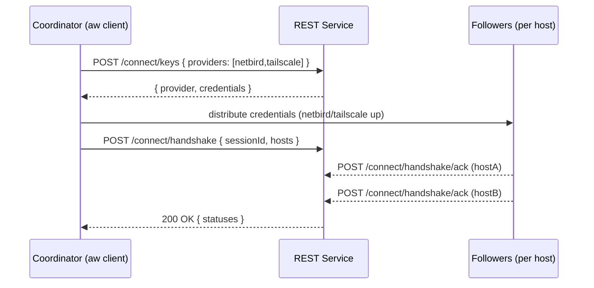
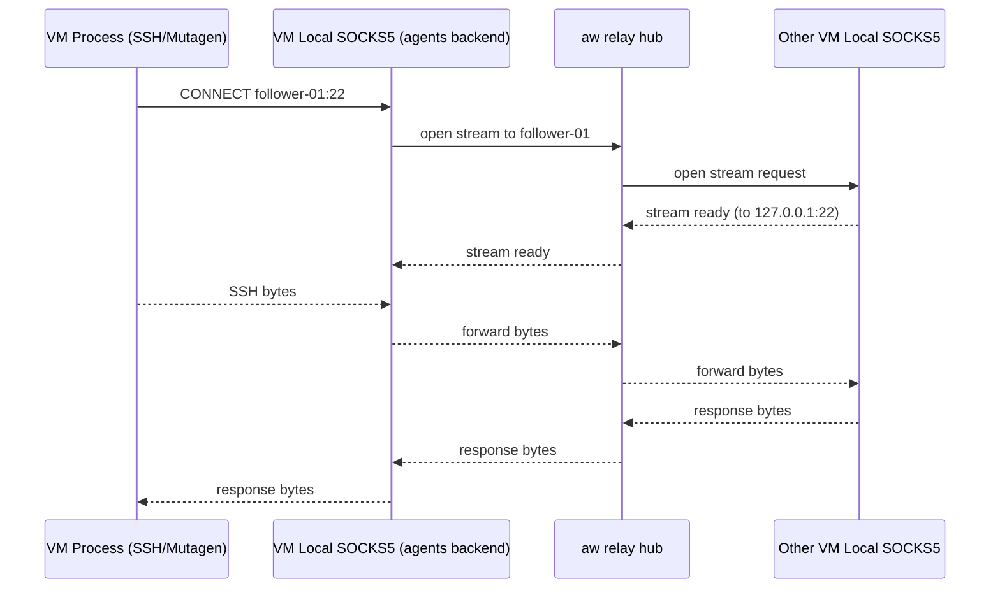
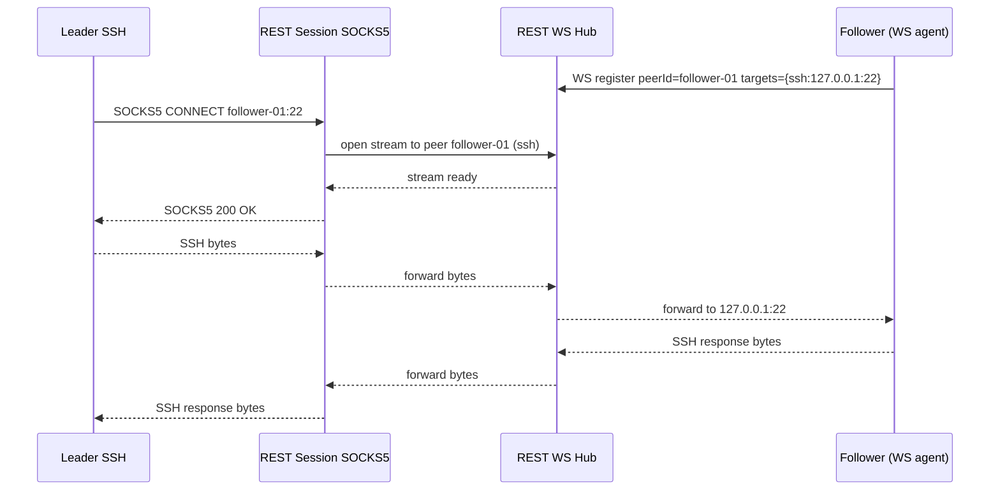

## Connectivity Layer — Overlay Networking for Leader/Followers

### Purpose

Provide reliable, low‑friction connectivity for run‑everywhere and Mutagen between the leader and follower hosts across Linux, macOS, and Windows.

Key properties:
- One overlay per host/VM, not per task. All agent sessions reuse the same connectivity.
- Prefer SSH as the execution transport; Mutagen spawns its agent over SSH.

### Actors (Roles)

- **Coordinator**: The controller that creates sessions, provisions followers, requests connectivity credentials, and orchestrates handshakes (typically the `aw` client or WebUI backend acting on behalf of the user).
- **Leader**: The primary workspace host (Linux preferred) that owns FsSnapshots and initiates fences and run‑everywhere.
- **Followers**: Secondary hosts (Windows/macOS/Linux) that execute commands and validate builds/tests.

### Recommended Options

- Tailscale (default)
  - WireGuard‑based mesh with automatic NAT traversal, MagicDNS, device tags/ACLs, and optional Tailscale SSH.
  - Simple SSO onboarding across OS’s. Suitable for parallel tasks because a single daemon/TUN per host serves all sessions.
  - Userspace mode for locked‑down containers: `tailscaled --tun=userspace-networking --socks5-server=127.0.0.1:1055` and route SSH/Mutagen via the SOCKS proxy.
  - Self‑hosted control plane: Headscale.

  - Ephemeral nodes for short‑lived sessions:
    - Use ephemeral auth keys (or `--state=mem:`) so devices auto‑remove shortly after going offline; they receive a fresh IP each time.
    - Immediate cleanup: call `tailscale logout` on teardown.
    - Scope access via ACL tags (e.g., `tag:session-<id>` ↔ `tag:session-<id>` only).

- ZeroTier (good alternative)
  - L2/L3 virtual network with NAT traversal and central controller. Easy multi‑OS setup.
  - Use allocated overlay IPs/Magic DNS in `.agents/hosts.json`.

- Raw WireGuard (minimal)
  - Fast and simple, but manual key/IP management and NAT traversal setup. Best for small/static topologies or when WG is already in place.

- SSH‑only (fallback)
  - Direct SSH over public/private networks, or reverse SSH tunnels if followers cannot accept inbound connections. More ops overhead but universally available.

### Operational Guidance

- Standardize on SSH
  - Mutagen can run over SSH; run‑everywhere executes remote commands via SSH.
  - Keep follower SSH access non‑root; prefer short‑lived keys or Tailscale SSH.

- Host Catalog
  - Store overlay addresses and metadata in `.agents/hosts.json` (or via REST):
  ```json
  {
    "hosts": [
      { "name": "win-01", "os": "windows", "address": "win-01.tailnet.example", "tags": ["os=windows"], "sshUser": "builder" },
      { "name": "mac-01", "os": "macos",   "address": "100.101.102.103",       "tags": ["os=macos"],   "sshUser": "builder" }
    ]
  }
  ```

- Security
  - Use overlay ACLs (Tailscale/ZeroTier) to restrict leader↔follower reachability.
  - Disable password auth on SSH; prefer keys/SSO; limit to non‑privileged users.
  - For NetBird: create Setup Keys with `ephemeral=true`, optional `reusable`, and `auto_groups` to isolate short‑lived peers; peers auto‑purge after inactivity. Use API `DELETE /api/peers/{id}` for immediate removal.

- Performance
  - Co‑locate followers when possible; validate MTU; monitor sync‑fence latency in CI multi‑OS smoke tests.

### NetBird Support (ephemeral peers)

Workflow:

1) Coordinator requests an ephemeral Setup Key from the Agents‑Workflow REST service (see REST section below).
2) Followers run `netbird up --setup-key <KEY>`.
3) Access is scoped via `auto_groups` and policies (only session peers can talk to each other and the leader).
4) Teardown: stop the agent; peers auto‑purge after ~10 minutes of inactivity, or the coordinator calls `DELETE /api/peers/{id}` via NetBird API for immediate removal.

Notes:
- Keys may be reusable to simplify parallel follower startup; groups isolate session scope.
- Ephemeral peers should not be referenced by fixed IPs; use names/groups.

### Fallback Relay Mode (no overlay available)

When the server or client reports overlays are unavailable, the coordinator can relay messages/logs between leader and followers.

- Transport: Server‑Sent Events (SSE) for downstream (client subscribe) and HTTP POST for upstream (client publish).
- Channels: Namespaced by `sessionId` and `host`.
- Scope: run‑everywhere control messages, stdout/stderr, exit codes, and minimal Mutagen control signals (not bulk sync).

Relay behavior:
- Followers subscribe to `/relay/{sessionId}/{host}/control` and `/relay/{sessionId}/{host}/stdin`.
- Followers POST logs to `/relay/{sessionId}/{host}/stdout` and `/relay/{sessionId}/{host}/stderr`, and status to `/relay/{sessionId}/{host}/status`.
- Leader/client multiplexes commands to followers and aggregates outputs.

### Handshake & Sync Confirmation

Goal: Confirm follower connectivity (overlay or relay) before first run‑everywhere, with a short timeout.

Sequence (overlay path):
1) Client → REST: `POST /connect/keys` (request ephemeral keys for preferred provider in priority order: netbird → tailscale).
2) Server → Client: returns available provider and session‑scoped credentials (e.g., NetBird setup key or Tailscale ephemeral auth key) plus ACL/group tags.
3) Client: distributes credentials to follower instances; followers join overlay.
4) Client → REST: `POST /connect/handshake` with the list of expected followers.
5) Followers → REST: `POST /connect/handshake/ack` upon successful join (overlay reachability + SSH check).
6) Server → Client: `200 OK` when all acks received or timeout reached; includes per‑host status.

Fallback (relay path): Same handshake but without overlay checks; followers instead establish SSE subscriptions; acks include relay stream readiness.

### Sequence Diagram (overlay path)



### Fallback Transport (no overlay, no public IPs)

Assumptions: No TUN devices (no Tailscale/NetBird dataplane), no inbound connectivity to the Coordinator (no public IP), and HTTP CONNECT is not available/useful.

Approach A (VM‑hosted SOCKS + client relay hub — default in ad‑hoc fleets):

- Each VM runs the agents‑workflow backend which exposes a local SOCKS5 proxy on 127.0.0.1 (inside the VM). All software in the VM (SSH, Mutagen) uses this local SOCKS to reach other fleet members.
- The `aw` client maintains persistent control connections to each VM backend and relays per‑connection bytestreams between VMs (leader ↔ follower) over these client↔VM links.
- This requires zero inbound connectivity and no public IPs; only outbound from the client to each VM.

Mermaid sequence (VM‑local SOCKS, client relay hub):



Approach B (server‑hosted): A REST‑hosted, per‑session SOCKS5 rendezvous that tunnels TCP streams over WebSockets.

- **Session SOCKS5 Relay (REST‑hosted)**
  - The REST service exposes a SOCKS5 front‑end that does not reach the public internet. Instead, it maps "destinations" to registered peers (leader/followers) connected via WebSocket.
  - Peers register their local endpoints (e.g., `ssh: 127.0.0.1:22`) over a persistent WebSocket: `WS /api/v1/connect/socks/register?peerId=...&role=leader|follower`.
  - The SOCKS5 server accepts `CONNECT follower-01:22` from the leader’s SSH and forwards bytes over the follower’s WebSocket to its local `127.0.0.1:22`.
  - Similarly, Mutagen using SSH as transport routes through `ProxyCommand` to the session SOCKS5 server.

- **Why this works without public IPs**
  - Both leader and followers initiate outbound WebSocket connections to the REST service. The service stitches the bytestreams, acting as a rendezvous.

- **Client configuration**
  - SSH config on leader (example):
  ```
  Host follower-01
    HostName follower-01
    ProxyCommand nc -X 5 -x socks.rest.example:1080 %h %p
  ```
  - Mutagen: configure SSH to use the same `ProxyCommand`.

Mermaid sequence (server‑hosted SOCKS5 rendezvous):



Note: In both approaches, HTTP CONNECT is not assumed available and public IPs are not required.

### Userspace VPN SOCKS fallback (when TUN fails)

If the Coordinator has provided ephemeral overlay credentials (NetBird/Tailscale), but VMs fail to create TUN interfaces, each VM launches a userspace VPN daemon that exposes a local SOCKS5 proxy. All VM processes (SSH, Mutagen, etc.) use this local SOCKS as above, and traffic is relayed either by the aw client (ad‑hoc fleets) or by the REST server (server‑hosted rendezvous).


